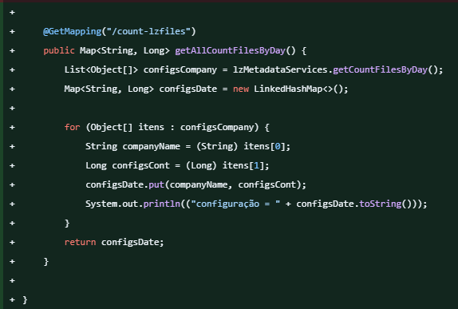

# Cauan Vinicius Mendes Barbaglio

## Introdução
Meu nome é Cauan Barbaglio, ingressei na Fatec no inicio de 2023, visando começar e desenvolver minha carreira profissional na área de T.I. Participei de projetos internos no qual me desenvolvi.

## Contatos

➡️[GitHub](https://github.com/Cauanvmb)
<br>
➡️[LinkedIn](https://www.linkedin.com/feed/)

## Principais Conhecimentos

➡️[Linguagem Java](https://docs.oracle.com/en/java/)
<br>
➡️[Spring Boot](https://docs.spring.io/spring-boot/index.html)
<br>
➡️[MySQL](https://dev.mysql.com/doc/)

## Meus Projetos

### Em 2024-1
A Dom Rock possui uma arquitetura de processamento de dados em cadeia chamada pipeline, que inclui vários estágios. Esses estágios são orquestrados automaticamente com base nas características das fontes de dados e nas soluções de algoritmos de IA ou modelos matemáticos, conforme as necessidades dos clientes. Durante a implantação da solução, é necessário configurar as fontes de dados envolvidas para que a plataforma funcione corretamente. Atualmente, essa configuração é feita manualmente, o que é um passo crítico e demorado para os técnicos. O desafio, portanto, é criar uma interface amigável para facilitar essa configuração das fontes de dados.

[GIT - Dom Rock Pipeline](https://github.com/wiz-fatec/dom-rock-pipeline-configurator)

### Tecnologias Utilizadas


1. Java<br>
Linguagem de programação amplamente usada para desenvolvimento da aplicação, utilizado somente no backend. Foi importante para criar uma aplicação robusta e escalável.

2. Spring<br>
Framework para desenvolvimento de aplicações Java, ofereceu suporte para injeção de dependências, gerenciamento de transações e criação de APIs REST. Facilitando a criação de aplicações web e microserviços.

3. HTML <br>
Linguagem de marcação utilizada na construção de páginas na Web.

4. CSS<br>
Linguagem de estilo usada para descrever a apresentação de documentos HTML. Foi importante para estilizar e formatar páginas web, melhorando a aparência e a experiência do usuário.

5. Vue.js<br>
Framework JavaScript para construção de interfaces de usuário interativas. Facilita a criação de aplicações web dinâmicas e reativas com uma arquitetura de componentes.

6. MySQL<br>
Sistema de gerenciamento de banco de dados relacional. Crucial para armazenar e gerenciar dados de forma estruturada em aplicações web.

7. Git<br>
Sistema de controle de versão distribuído. Essencial para rastrear mudanças no código-fonte e colaborar com outros desenvolvedores de forma eficiente.

8. GitHub<br>
Plataforma de hospedagem para projetos que utilizam Git. Importante para o compartilhamento de código, colaboração e controle de versão em projetos de software.

9. Stack Overflow<br>
Plataforma de perguntas e respostas para desenvolvedores. Importante para obter suporte, resolver problemas e aprender com a comunidade de programadores.

10. Visual Studio<br>
Editor de código-fonte leve, mas poderoso, que é executado na área de trabalho e está disponível para Windows, macOS e Linux.
## Contribuições pessoais

<details>
  <summary>Método: getAllCountFilesByDay</summary>
  
  - **Anotação**: Implementado com a anotação `@GetMapping`.
  - **URL Mapeada**: `/count-lzfiles`.
  - **Retorno**: Retorna uma contagem de arquivos por dia em um formato `Map<String, Long>`.
  - **Funcionamento**:
    - Chama o serviço `lzMetadataServices` para recuperar a lista de contagens diárias.
    - Processa o resultado em um `LinkedHashMap`.
  - **Processamento dos Dados**:
    - Para cada item:
      - Extrai o nome da empresa.
      - Extrai a contagem de configurações.
      - Insere esses valores no mapa `configsDate`.
  - **Debug**: Imprime o mapa no console para verificar o conteúdo.
  - **Retorno Final**: Retorna o mapa preenchido com os valores de contagem de arquivos por dia.



</details>
<details>
  <summary>Método: countFilesByDay</summary>
  
  - **Anotação**: Implementado com a anotação `@Query` para executar uma consulta SQL nativa.
  - **Descrição da Consulta**:
    - **Objetivo**: Retornar a contagem de arquivos agrupados por dia.
    - **Consulta**: 
      ```sql
      SELECT DATE_FORMAT(file_timestamp, '%d-%m-%Y') as DAY, COUNT(file_id) as QTD 
      FROM lz_config 
      GROUP BY DATE_FORMAT(file_timestamp, '%d-%m-%Y') 
      ORDER BY DATE_FORMAT(file_timestamp, '%d-%m-%Y')
      ```
  - **Explicação dos Campos**:
    - `DATE_FORMAT(file_timestamp, '%d-%m-%Y') as DAY`: Formata o campo `file_timestamp` para o formato `dd-MM-yyyy`, representando a data como um dia único.
    - `COUNT(file_id) as QTD`: Conta o número de ocorrências de `file_id` para cada dia.
  - **Agrupamento e Ordenação**:
    - **Agrupamento**: A consulta agrupa os resultados por dia (`DATE_FORMAT(file_timestamp, '%d-%m-%Y')`), consolidando a contagem de arquivos de cada dia.
    - **Ordenação**: Ordena os dias no formato `dd-MM-yyyy`.
  - **Retorno**: 
    - Retorna uma lista de objetos (`List<Object[]>`), onde cada elemento do array contém:
      - O dia (`String`)
      - A quantidade de arquivos (`Long`) no respectivo dia.<br><br><br>
- 
</details>
<details>
  <summary>Função: fetchBarChartData</summary>
  
  - **Interface `BarChartData`**:
    - Define o formato dos dados necessários para o gráfico de barras.
    - Campos:
      - `labels`: Array de `string` representando os rótulos no eixo X do gráfico.
      - `values`: Array de `number` com os valores correspondentes a cada rótulo.
      - `colors`: Array de `string` que define as cores das barras no gráfico.
      - `label`: Texto que descreve o conjunto de dados.

  - **Objeto `barChartData`**:
    - Usado para armazenar os dados do gráfico de barras, inicializado com valores vazios.
    - `label` inicia com o valor `"quantidade de configurações"`.

  - **Função `fetchBarChartData`**:
    - Função assíncrona que busca dados do backend para preencher `barChartData`.
    
    - **Passos**:
      1. **Requisição de Dados**:
         - Realiza uma chamada `fetch` para a URL `http://localhost:8080/lz-config/count-lzfiles`.
         - Recebe a resposta em formato JSON.
      
      2. **Processamento dos Dados**:
         - Extrai as chaves e valores do objeto `data` retornado:
           - `labels1`: Contém as chaves de `data` (nomes das empresas ou datas, por exemplo).
           - `values1`: Contém os valores correspondentes (quantidade de configurações por chave).
      
      3. **Atualização do `barChartData`**:
         - Atualiza `barChartData.value` com os dados obtidos:
           - `labels`: Usa `labels1` para os rótulos do gráfico.
           - `values`: Usa `values1` para os valores do gráfico.
           - `colors`: Chama `generateColors(1)` para definir as cores das barras.
           - `label`: Mantém o valor `"quantidade de configurações"`.
      
      4. **Tratamento de Erro**:
         - Em caso de falha na requisição, exibe um erro no console.
- 
</details>

  